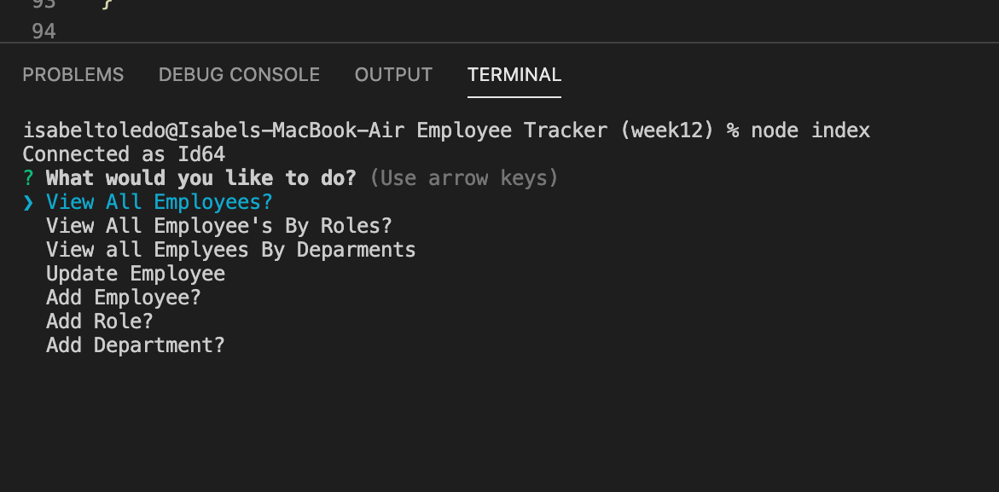

# Employee Tracker





### Desription

A command line application that allows the user to view their employee directory by departments, roles and employees.  Also allows user to add departments, roles and employees as well as update all three. 

  

  
### Video Walkthrough
 https://drive.google.com/file/d/1zkZCXh0yIpJejlENZtNO3kuEBN_5j9kF/view   
 


### Installation
```
Npm i - to install all necessary dependencies 
```


### Instructions 
```
- Npm i
- Copy Schema and open on SQL workbench to seed data
- Enter command line "node index" to start prompts
```

### Technologies Used:
 - mySQL
 - JavaScript
 - Inquirer package
 - Node.js


